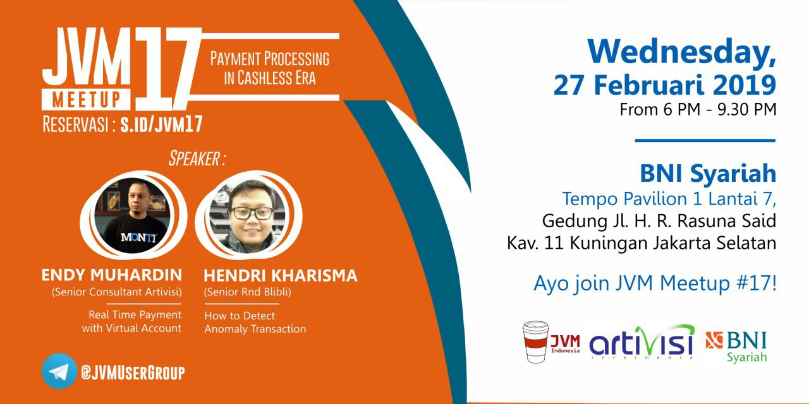
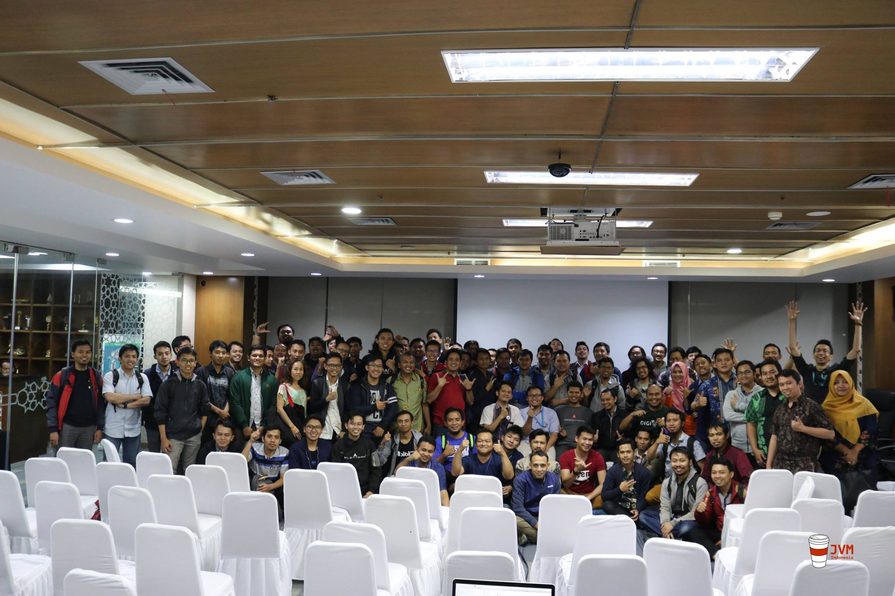

# JVM-Meetup-17
Summarize from JVM Meetup #17 @ BNI Syari'ah Pusat

- 19A Jalan Haji R. Rasuna Said  Pavilion Tempo 1 Floor 6

## Speaker :

1. Endy Muhardin (Senior Consultant Artivisi) : ["Real Time Payment with Virtual Account".](https://drive.google.com/open?id=10HEwk9YsEQ8mp3Sq4dQzecjTSepsakFN)
2. Hendri Kharisma (Senior Rnd Blibli): ["How to detect anomaly transaction".](https://drive.google.com/open?id=1vGrrAweOOUvv-vT_s9ODl6Cx1ojDv6Ka)

Photo Session

Ayo join JVM User Group di telegram untuk diskusi lebih lanjut.

Join Us : [@JVMUserGroup](t.me/JVMUserGroup)

Like & Follow Instagram : [JVM Indonesia](https://www.instagram.com/jvmindonesia/)

Like & Follow : [JVM Developer ID](https://www.facebook.com/JVMDeveloperID/)

Subscribe : [JVM Indonesia](https://www.youtube.com/channel/UCXwXmQEQySqhqAMmys4N56w)